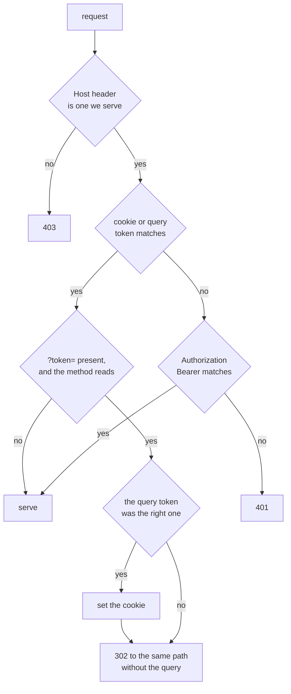
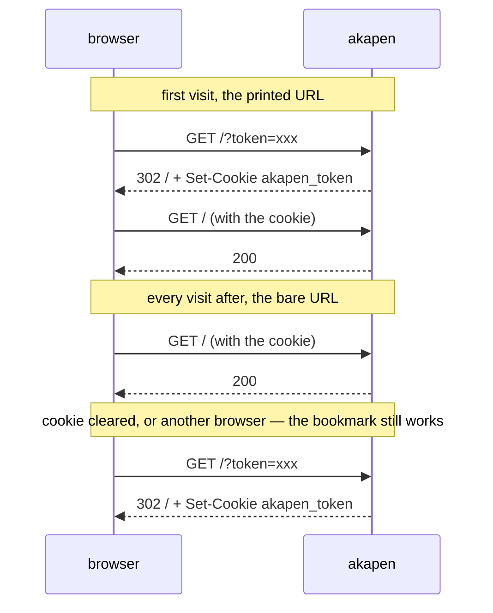
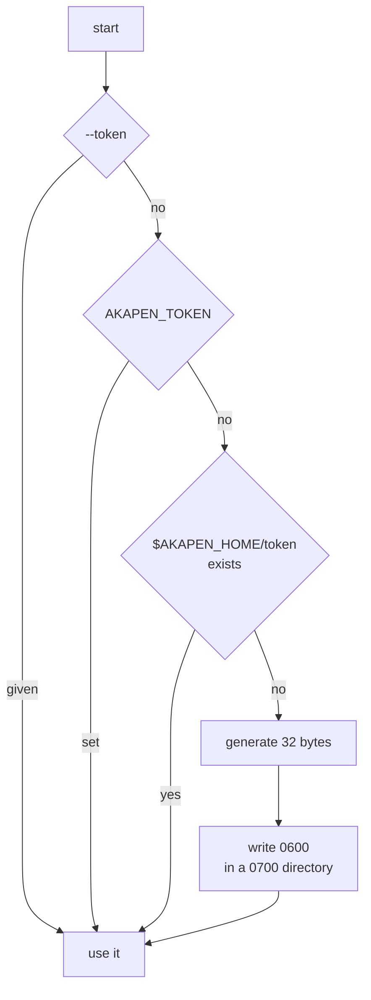
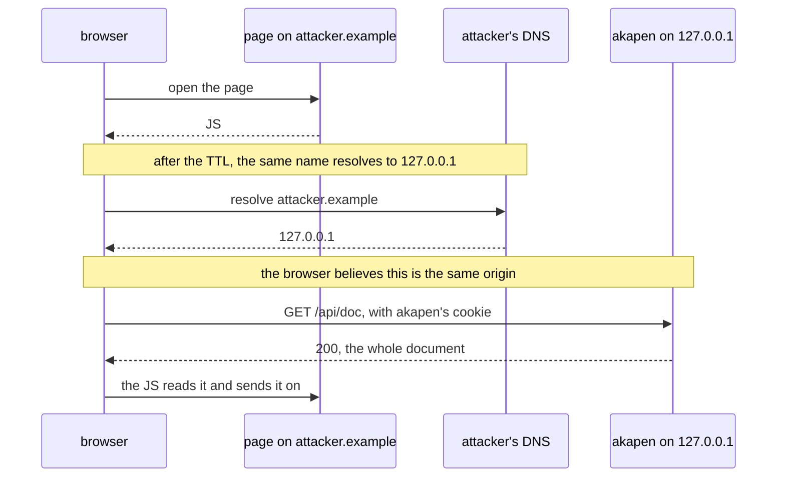

# Authentication

Issue #10. What it is, what it is not, and why each of the alternatives was left.

## What is protected

Before this, `--host 0.0.0.0` put four things on the LAN with no credential.

- The document under review. In a vault that is a personal note, and it is the whole file.
- Every comment on it, earlier rounds included.
- The absolute path of the file, returned by `/api/doc`.
- Write access: comments, replies, resolve, and cutting a round — which is destructive to any other screen mid-review.

## What is not protected

- A passive listener on the same segment. There is no TLS, so the token crosses the wire in the clear. On switched Ethernet or WPA2/3 the exposure is narrow, but it is not zero and no token closes it. Terminate TLS in front and run with `--no-auth` where that matters.
- Another process running as the same user on the same host. It can read `~/.akapen/` and the markdown directly, so a credential in front of the port gives it nothing new.

## Accepted limits

These follow from the design rather than from an oversight. They are written down so that nobody has to rediscover them, and so a later change knows what it would be trading away.

- **A sniffer on the segment gets everything.** No TLS, so the token is in the clear on every request, and it does not expire — one capture is good until somebody runs `akapen token --rotate`. Terminate TLS in front where this matters, and bind akapen to loopback behind it: TLS in front is worth nothing while the plain port is still listening on the LAN beside it.
- **The token is in the printed URL, and stays in the bookmark.** That is what makes it work without a login page, and it means the secret also lives in terminal scrollback, in browser bookmark sync, and in any proxy log that records query strings. Pasting that URL to somebody hands them the host.
- **`--token` is visible in `ps` and in shell history.** `AKAPEN_TOKEN` supplies one without that.
- **One token is one level of access.** There is no read-only and no per-document scope: whoever holds it can comment, resolve and cut a round on every akapen on that host. Rotation is the only revocation, it locks out everyone at once, and it reaches servers that are already running.
- **The machine's short hostname is served.** Reaching it as `http://mcdev:4300` is ordinary and refusing that would break it. Someone who can answer mDNS for that name on the LAN can therefore put a page on an origin akapen serves; the write check below is what stops that page from doing anything with it.
- **Browsers older than `Sec-Fetch-Site` get no cross-origin write protection.** Chrome 76, Firefox 90 and Safari 16.4 and later send it.

## What it is

A shared secret, presented three ways, checked in one middleware ahead of every route.

- The cookie is the steady state, the query is the first visit and the bookmark, the bearer header is curl and agents.
- The comparison is timing-safe, over two SHA-256 digests so that a wrong length costs the same as wrong contents.
- The cookie is `HttpOnly`, `SameSite=Lax`, `Path=/`, and not `Secure` — a `Secure` cookie over plain HTTP is never stored, which would turn the flow into a redirect loop.
- Authentication is on at every bind address. Deciding it from the bind address would make the rule depend on the one flag people forget they typed, and loopback is not private in the way it looks.

## Why it is seamless

- No login page, no prompt, no second step: opening the printed URL once per browser is all of it.
- The redirect takes the token out of the address bar and the history entry. The bookmark keeps its copy on purpose, which is what recovers a cleared cookie without anyone going to find a URL.
- It redirects on every visit with a token in the URL, not only when the cookie is missing. Answering on the cookie and stopping there would put the secret back in the address bar each time the bookmark was opened — the redirect would have worked exactly once per browser.
- The cookie is written only when the query itself was right, so a bookmark holding a rotated-away token is stripped rather than stored over a cookie that still works.
- Only methods that read are redirected. Redirecting a `POST` loses its body, and a token on the query of one is a credential rather than something anybody is about to bookmark.
- `packages/web/src/app.ts` did not change. Every request it makes is a same-origin relative path and `EventSource` sends cookies same-origin, so one cookie covers the API, the posts and the SSE stream. This is the reason for choosing a cookie over a header the client has to attach: `EventSource` cannot attach one at all.
- `akapen comments` reads the store off disk and never speaks HTTP, so the agent handoff is untouched.

## One token per host

- Cookies are not isolated by port (RFC 6265 §8.5), so opening any one instance authenticates the browser for every akapen on that host, including ones started later.
- The number of times a token must be presented is therefore browsers × hostnames, not instances. Reaching the same machine by another name (`192.168.0.10` after `mcdev`) is a different cookie domain and wants the token once more.
- Per-instance tokens would need per-instance cookie names to avoid overwriting each other, and would buy a separation a single-user tool has no use for.
- The instance switcher (#86) probes its peers over HTTP, so those probes carry the token too. A peer started with a different one is answered `401` and reads as not running.

## Where the token lives

- Resolution order is `--token`, then `AKAPEN_TOKEN`, then the stored one. Even so, prefer `AKAPEN_TOKEN` when supplying one yourself: a flag is visible in `ps` output and in shell history.
- Neither a flag nor an environment token is written to disk. Persisting one would quietly make somebody else's secret this host's secret for every later run.
- The server re-reads it rather than capturing it at startup, so `akapen token --rotate` locks out the open cookies and running scripts without waiting for every instance to be restarted. A token handed in with `--token` or `AKAPEN_TOKEN` is pinned instead: it belongs to whoever passed it, and a rotation on this host is not theirs to be told about.
- It is persisted so that the URL survives a restart, which is the condition for a bookmark being worth keeping. A token generated per run is seamless too, right up until the cookie is cleared — and then the bookmark is dead.
- The cookie is given a year, because the token behind it does not expire and a session cookie would mean logging in again after every browser restart — the thing this flow exists to avoid.
- The token itself does not expire. An expiring token means the bookmark breaks on a schedule, which is the thing this design exists to avoid; expiry would need separate lifetimes for the cookie and the token, and that is a different design.
- `akapen token` prints it, so scripts read it from the command rather than hardcoding a path.
- A generated token never starts with `-`. base64url contains it, and `args.ts` reads a value beginning with a dash as an option rather than a value — deliberately, so `--author --all` fails instead of taking a flag as a name. Rather than carve an exception into that rule, the generator does not produce the character in front. A token supplied by hand that starts with `-` still needs the attached form, `--token=-abc`.

## The Host check, which the token does not cover

- The token stops none of this: the browser is holding a valid one and attaches it itself. `HttpOnly` is irrelevant — the browser, not the script, is doing the attaching.
- What a script cannot choose is the `Host` header, so refusing every name akapen does not serve closes the class. Allowed: the bind address, `localhost`, `127.0.0.1`, and the machine's own interface addresses under a wildcard bind — every one of them a literal address or `localhost`.
- The machine's own hostname is **not** allowed, although reaching akapen by name is the ordinary thing to want. It is the only name in the set that somebody else on the network can claim: answer mDNS for `mcdev`, serve a page from that name on akapen's port, then rebind the name to this machine. The browser is then on a page whose origin — scheme, host and port — matches akapen's exactly, so it attaches the cookie, reads every answer, and passes the write check as `same-origin` too.
- That last part is worth being explicit about, because an earlier draft of this document claimed the `Sec-Fetch-Site` check covered it. It does not. That check separates origins; rebinding works by making them the same origin. Nothing but refusing the name closes it.
- The set is rebuilt when a name is not recognised, at most once a second. Under a wildcard bind it is the machine's own addresses, and those change underneath a running process — joining a VPN or moving network gives it one it did not have at startup, and every request to that address would otherwise be a 403 with nothing wrong.
- It stays on under `--no-auth`, because it answers a different question from "who may connect".
- A missing `Host` is refused. It cannot happen today — Bun answers a Host-less HTTP/1.1 request with a 500 before any of this runs — so there is no test for it; one would pass with the branch removed and pin nothing.
- `SameSite=Lax` covers the ordinary cross-site case beneath it: another site's `fetch` or form post carries no cookie.

## Writes have to come from akapen's own page

- `SameSite` is about the *site*, and a site does not include the port. Anything served from another port on this host — a dev server, a static file server, another person's process on a shared machine — is same-site, so the browser attaches akapen's cookie to requests it makes here.
- A `POST` with no body is a CORS-simple request, so no preflight stands in the way either. Before this check a page on `localhost:8080` could cut a round on `localhost:4300`. It could not read the answer, since nothing here sends CORS headers, but the round had still moved under whoever was reading.
- Unsafe methods therefore require `Sec-Fetch-Site` to be `same-origin`, `none`, or absent.
- `Sec-Fetch-Site` rather than comparing `Origin` with `Host`: the browser works it out from what it sees, so a TLS-terminating proxy in front — the arrangement `--no-auth` exists for — still reads as `same-origin`, where comparing the two headers would refuse every write.
- Reads are left alone. Without CORS headers a cross-origin read cannot be read back, and a `GET` changes nothing either way.

## Rejected

### A login page with a password

- There is no user list and no account to belong to.
- It would be a second secret protecting the same single one, and a prompt in front of every new browser.

### A reverse proxy in front, as the answer

- #10 names it as the direction to avoid, because it tends to mean logging in every time.
- It does not travel: it has to be set up once per host, and akapen with nothing in front stays open.

### Trusting a proxy-set header

- crit's `proxy_auth` shape. Safe only when nothing but the proxy can reach the port, which is a deployment fact akapen cannot verify.
- Can be added behind an explicit flag if a proxy is ever actually used.

### A token per review

- More secrets in more bookmarks, for no separation that matters to one person reviewing their own files.

### Delegating to Tailscale Serve

- Not rejected. It is a good answer where Tailscale is installed, because it authenticates rather than only encrypting — run with `--no-auth` behind it, bound to loopback. A front that only terminates TLS is a different thing and does not earn `--no-auth`: keep the token on behind one.
- `--no-auth` removes the credential entirely, so it is only safe when the port cannot be reached except through the thing in front. The `Host` check is not a substitute: it is not a credential, and a client connecting directly sends whatever name it likes.
- It is simply not something akapen can implement.
