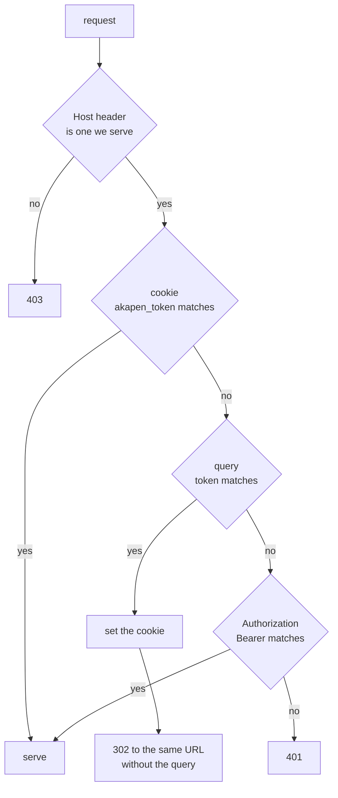
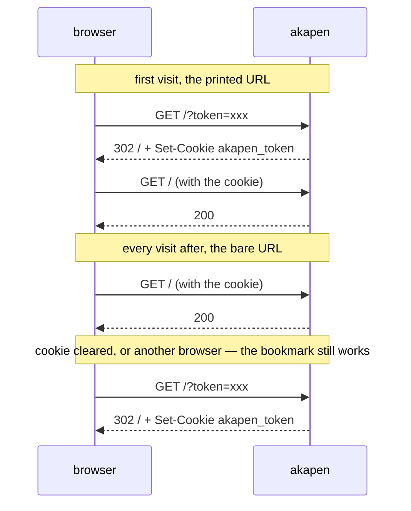
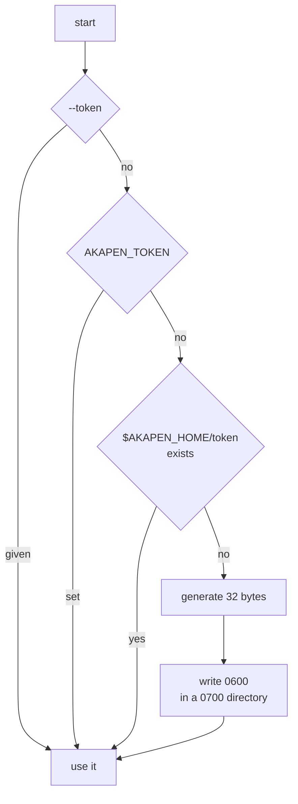
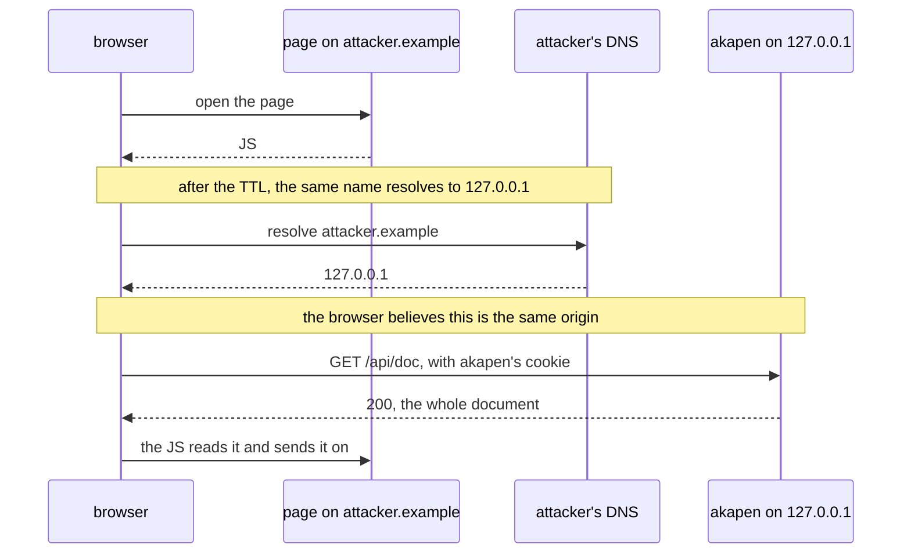

# Authentication

Issue #10. What it is, what it is not, and why each of the alternatives was left.

## What is protected

Before this, `--host 0.0.0.0` put four things on the LAN with no credential.

- The document under review. In a vault that is a personal note, and it is the whole file.
- Every comment on it, earlier rounds included.
- The absolute path of the file, returned by `/api/doc`.
- Write access: comments, replies, resolve, and cutting a round — which is destructive to any other screen mid-review.

## What is not protected

- A passive listener on the same segment. There is no TLS, so the token crosses the wire in the clear. On switched Ethernet or WPA2/3 the exposure is narrow, but it is not zero and no token closes it. Terminate TLS in front and run with `--no-auth` where that matters.
- Another process running as the same user on the same host. It can read `~/.akapen/` and the markdown directly, so a credential in front of the port gives it nothing new.

## What it is

A shared secret, presented three ways, checked in one middleware ahead of every route.

- The cookie is the steady state, the query is the first visit and the bookmark, the bearer header is curl and agents.
- The comparison is timing-safe, over two SHA-256 digests so that a wrong length costs the same as wrong contents.
- The cookie is `HttpOnly`, `SameSite=Lax`, `Path=/`, and not `Secure` — a `Secure` cookie over plain HTTP is never stored, which would turn the flow into a redirect loop.
- Authentication is on at every bind address. Deciding it from the bind address would make the rule depend on the one flag people forget they typed, and loopback is not private in the way it looks.

## Why it is seamless

- No login page, no prompt, no second step: opening the printed URL once per browser is all of it.
- The redirect takes the token out of the address bar and the history entry. The bookmark keeps its copy on purpose, which is what recovers a cleared cookie without anyone going to find a URL.
- `packages/web/src/app.ts` did not change. Every request it makes is a same-origin relative path and `EventSource` sends cookies same-origin, so one cookie covers the API, the posts and the SSE stream. This is the reason for choosing a cookie over a header the client has to attach: `EventSource` cannot attach one at all.
- `akapen comments` reads the store off disk and never speaks HTTP, so the agent handoff is untouched.

## One token per host

- Cookies are not isolated by port (RFC 6265 §8.5), so opening any one instance authenticates the browser for every akapen on that host, including ones started later.
- The number of times a token must be presented is therefore browsers × hostnames, not instances. Reaching the same machine by another name (`192.168.0.10` after `mcdev`) is a different cookie domain and wants the token once more.
- Per-instance tokens would need per-instance cookie names to avoid overwriting each other, and would buy a separation a single-user tool has no use for.
- The instance switcher (#86) probes its peers over HTTP, so those probes carry the token too. A peer started with a different one is answered `401` and reads as not running.

## Where the token lives

- `AKAPEN_TOKEN` is preferred over `--token` in practice because a flag is visible in `ps` output and shell history.
- Neither a flag nor an environment token is written to disk. Persisting one would quietly make somebody else's secret this host's secret for every later run.
- It is persisted so that the URL survives a restart, which is the condition for a bookmark being worth keeping. A token generated per run is seamless too, right up until the cookie is cleared — and then the bookmark is dead.
- It does not expire. An expiring token means the bookmark breaks on a schedule, which is the thing this design exists to avoid; expiry would need separate lifetimes for the cookie and the token, and that is a different design.
- `akapen token` prints it, so scripts read it from the command rather than hardcoding a path.

## The Host check, which the token does not cover

- The token stops none of this: the browser is holding a valid one and attaches it itself. `HttpOnly` is irrelevant — the browser, not the script, is doing the attaching.
- What a script cannot choose is the `Host` header, so refusing every name akapen does not serve closes the class. Allowed: the bind address, `localhost`, `127.0.0.1`, the machine's own interface addresses under a wildcard bind, and its hostname.
- It stays on under `--no-auth`, because it answers a different question from "who may connect".
- A missing `Host` is allowed rather than refused. Rebinding needs a browser and browsers always send one, so refusing would break odd clients for nothing.
- `SameSite=Lax` covers the ordinary cross-site case beneath it: another site's `fetch` or form post carries no cookie.

## Rejected

### A login page with a password

- There is no user list and no account to belong to.
- It would be a second secret protecting the same single one, and a prompt in front of every new browser.

### A reverse proxy in front, as the answer

- #10 names it as the direction to avoid, because it tends to mean logging in every time.
- It does not travel: it has to be set up once per host, and akapen with nothing in front stays open.

### Trusting a proxy-set header

- crit's `proxy_auth` shape. Safe only when nothing but the proxy can reach the port, which is a deployment fact akapen cannot verify.
- Can be added behind an explicit flag if a proxy is ever actually used.

### A token per review

- More secrets in more bookmarks, for no separation that matters to one person reviewing their own files.

### Delegating to Tailscale Serve

- Not rejected. It is a good answer where Tailscale is installed and it composes with this — run with `--no-auth` behind it.
- It is simply not something akapen can implement.
