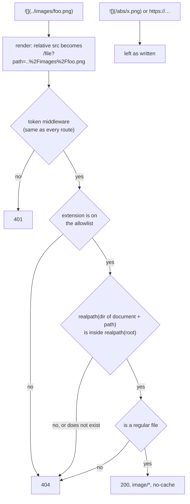

# Document images

Issue #81. A document that says `` shows that image, read from beside the document. What is served, what is refused, and why each decision went the way it did.

## To-Be

- `` and `` render in the preview, the way any other markdown renderer resolves them: relative to the document.
- Nothing else about the file system is reachable. A path that leaves the file root, a file that is not an image, and a directory are all refused with a 404.
- No new syntax. The markdown stays exactly what it was.

## How a request flows

- The path travels in a query parameter rather than in the URL path. A browser normalises `/../images/foo.png` to `/images/foo.png` before sending it, so a document-relative `..` cannot survive as a path segment.
- Containment is checked on the real path, after resolving symlinks, on both sides. A request string with no `..` in it can still walk out through a symlink, so looking at the string decides nothing.
- Every refusal is the same 404. Answering 403 for "exists but outside" would let a reader probe the file system for what exists.
- It sits behind the same token check as everything else (#10), so on `--host 0.0.0.0` it is not open to the LAN.

## Decisions

### Which extensions

`png` / `jpg` / `jpeg` / `gif` / `webp` / `avif` / `svg`, matched case-insensitively.

- An allowlist, not a blocklist: a server that returns `.env` because nobody listed it is the failure this avoids.
- `svg` is included because diagrams are the main use (LikeC4 and diagram-design export it). It is served as `image/svg+xml` with `Content-Security-Policy: default-src 'none'; style-src 'unsafe-inline'; sandbox` and `X-Content-Type-Options: nosniff`.
  - From ``, script in an SVG never runs anyway.
  - The header covers the other way in: somebody opening the `/file?…` URL directly, where the SVG would otherwise be a document on akapen's origin with its cookie.
- 捨てた案: leaving `svg` out. It is the format diagram tools export, and the header makes it no more capable than a PNG.

### What a round means for an image

Left as it is, and written down: a closed round shows the image as it is now, not as it was.

- A round freezes `content.md` only. History for text stays reproducible; history for images does not.
- An image deleted since shows as broken in a closed round, with nothing saying why. Accepted for the same reason.
- 捨てた案: copying referenced images into the round directory. It makes the store grow by the size of every screenshot on every round, for a history view that is rarely opened for its images.
- 捨てた案: hashing and marking a changed image. Worth doing if a real case of misleading history turns up; until then it is machinery for a problem nobody has hit.

### The file root in review mode

The document's own directory by default. `--root <dir>` widens the file root, and must contain the document: a root that does not hold it could serve none of its images, so startup refuses it rather than showing every image as a 404.

- The default serves only what sits beside the document and below it, which is the narrowest thing that makes ordinary documents work.
- A vault with `../images/foo.png` passes `--root` at the vault. Passive mode (#8) already means `--root` as "the tree being served", and this is the same flag with the same meaning.
- 捨てた案: defaulting to the git root or `$HOME`. Either one quietly opens far more than the document refers to.

### Caching

`Cache-Control: no-cache` with an ETag (size and mtime) on every image.

- Images are not frozen with a round (above), so a diagram re-exported beside the document has to show the next time the page asks for it — a reload, or the next round. A long cache would show the old one.
- `no-cache` makes the browser ask every time; the ETag makes the answer a 304 when nothing changed, rather than the whole file. Bun sends no validator of its own for a file body.

## Not in scope

- Remote images (`https://…`) and `data:` URIs. They are left as written.
- Absolute paths (`/abs/x.png`). Left as written, and so they 404 as before. #81 settled this ("absolute paths … are refused, not resolved"). Reading `/x.png` as relative to the file root, the way a static-site generator does, is a separate decision.
- Links to images (`[x](a.png)`, and so the linked thumbnail ``). Only `` is rewritten; the link still points at `/a.png` and 404s.
- A file swapped for a symlink between the check and the read (TOCTOU). Doing that needs write access under the file root, which already hands over everything the root holds.
- Commenting on a region of an image.
- A general static file server, and directory listings.
