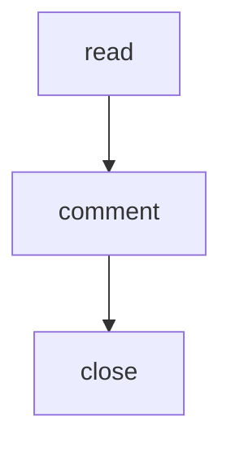

# Heading

The first paragraph. A test selects it, to watch that an event from the server does not drop the selection.

## What is settled

- a round is a frozen snapshot of the contents of the file
- a comment is tied to a line inside that snapshot
- closing a round is a person's call

## Table

| field | passive | review |
|---|---|---|
| body | follows the file | frozen |
| comments | not allowed | allowed |

## The last section

One long paragraph, here on purpose. It has to wrap, so that a row taller than one line exists to check two things against: that the anchor stays level with the first line of the row rather than its middle, and that a bubble out on the rail never changes the height of the document itself.

## Raw HTML

<script>window.xssMarker = 'executed';</script>


<b>not actually bold</b>

## Diagram



## Diagram (capitalised fence)

```Mermaid
graph TD
  D[write] --> E[revise]
```
