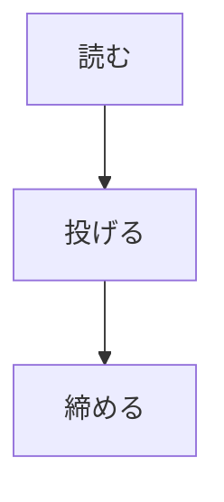

# 見出し

最初の段落。ここを選択してサーバ由来のイベントで消えないことを見る。

## 決まっていること

- ラウンドはファイル内容の凍結スナップショット
- コメントはそのスナップショット内の行に紐づく
- ラウンドを切るのは人

## 表

| 項目 | passive | review |
|---|---|---|
| 本文 | live 追従 | 凍結 |
| コメント | 打てない | 打てる |

## 最後の節

長い段落を 1 つ置いておく。折り返しても 1 行目にアンカーが揃うことと、レールの吹き出しが本文の高さを変えないことを確認するために使う。

## 生 HTML

<script>window.xssMarker = 'executed';</script>


<b>太字にはならない</b>

## 図



## 図（大文字の fence）

```Mermaid
graph TD
  D[書く] --> E[直す]
```
